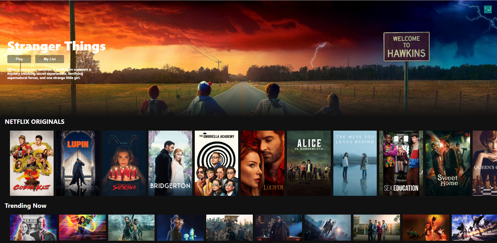

# Netflix Clone

 

## Description
This Front-end Netflix Clone application uses React with Firebase Hosting. It pulls in movies from The Movie Database (TMDb) and maps through the different categories to display in the way Netflix does. 
  
Deployed Firebase LinkL: https://netflix-clone-30b09.web.app/
 
Tutorial by Clever Programmers. Link below.

## **Table of Contents**
1. [Usage](#usage)
2. [Technologies](#technologies)
3. [Questions](#questions)
4. [Visuals](#visuals)
5. [Links](#links)

## **Usage**
Click on a movie posters to watch their trailer. Application is set up to do nothing if a trailer is not found on YouTube. 

## **Technologies**
* React
* Firebase Hosting
* React-Youtube
* Movie-Trailer
* Axios
* TMDb API

## **Questions**
Contact me at kayla.b.newlon@gmail.com for any questions 

## **Visuals**

## **Links**
Repo: https://github.com/kbnewlon/netflix-clone 
Deployed Firebase LinkL: https://netflix-clone-30b09.web.app/ 
Tutorial by Clever Programmers: https://youtu.be/XtMThy8QKqU 